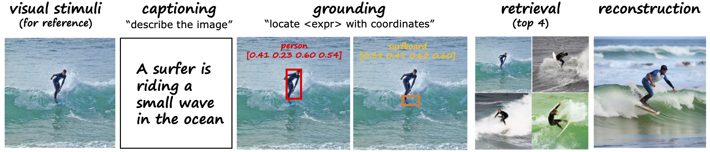

<div align="center">

<h2>UMBRAE: Unified Multimodal Decoding of Brain Signals</h2>

<div>
    <a href='https://weihaox.github.io/' target='_blank'>Weihao Xia</a><sup>1</sup>&emsp;
    <a href='https://team.inria.fr/rits/membres/raoul-de-charette/' target='_blank'>Raoul de Charette</a><sup>2</sup>&emsp;
    <a href='https://www.cl.cam.ac.uk/~aco41/' target='_blank'>Cengiz Öztireli</a><sup>3</sup>&emsp;
    <a href='http://www.homepages.ucl.ac.uk/~ucakjxu/' target='_blank'>Jing-Hao Xue</a><sup>1</sup>&emsp;
</div>
<div>
    <sup>1</sup>University College London&emsp;
    <sup>2</sup>Inria&emsp;
    <sup>3</sup>University of Cambridge&emsp;
</div>


<br/>

<!-- <h3 align="center">Preprint</h3> -->

<!-- --- -->

<!-- <h4 align="center">
  <a href="https://weihaox.github.io/BrainX" target='_blank'>[Project Page]</a> •
  <a href="https://www.youtube.com/watch?v=cUdkeigISOo" target='_blank'>[Video]</a>  •
  <a href="https://arxiv.org/pdf/2310.02265" target='_blank'>[arXiv]</a> <br> <br>
  
</h4> -->

</div>

<div align="center"><tr> 
    
</tr></div>

<div align="center"><tr>
    
</tr></div>

<br/>

<p>UMBRAE decodes multimodal explanations from brain signals. (1) We introduce a <b>universal brain encoder</b> for multimodal-brain alignment and recover conceptual and spatial details by using multimodal large language models. (2) We introduce <b>cross-subject training</b> to overcome unique brain patterns of different individuals. This allows brain signals from multiple subjects to be trained within the same model This allows brain signals from multiple subjects to be trained within the same model. (3) Our method supports <b>weakly-supervised subject adaptation</b>, enabling the training of a model for a new subject in a data-efficient manner. (4) For evaluation, we introduce <b>BrainHub</b>, a brain understanding benchmark, based on NSD and COCO.

## News :triangular_flag_on_post:
- [2024/03/15] Both <a href="https://weihaox.github.io/UMBRAE">project</a> and <a href="https://arxiv.org/pdf/2404.07202">arXiv</a> are available.

## Method

Overview of UMBRAE. Our brain encoder includes subject-specific tokenizers and a universal perceive encoder. Brain signals from multiple subjects are mapped into a common feature space, enabling cross-subject training and weakly-supervised subject adaptation. The brain encoder learns to align neural signals with image features. During inference, the learned encoder interacts with MLLMs and performs brain understanding tasks according to given prompts.

<div align="center"><tr>
    
</tr></div>

## Citation

```bibtex
@article{xia2024umbrae,
  author    = {Xia, Weihao and de Charette, Raoul and Öztireli, Cengiz and Xue, Jing-Hao},
  title     = {UMBRAE: Unified Multimodal Decoding of Brain Signals},
  journal   = {arxiv preprint:arxiv 2404.07202},
  year      = {2024},
}
```