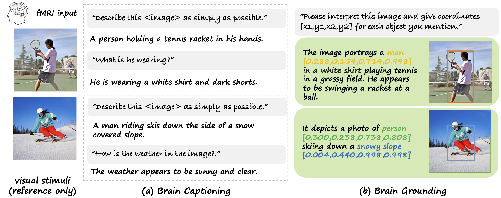

<div align="center">

<h2>UMBRAE: Unified Multimodal Decoding of Brain Signals</h2>

<div>
    <a href='https://weihaox.github.io/' target='_blank'>Weihao Xia</a><sup>1</sup>&emsp;
    <a href='https://team.inria.fr/rits/membres/raoul-de-charette/' target='_blank'>Raoul de Charette</a><sup>2</sup>&emsp;
    <a href='https://www.cl.cam.ac.uk/~aco41/' target='_blank'>Cengiz Öztireli</a><sup>3</sup>&emsp;
    <a href='http://www.homepages.ucl.ac.uk/~ucakjxu/' target='_blank'>Jing-Hao Xue</a><sup>1</sup>&emsp;
</div>
<div>
    <sup>1</sup>University College London&emsp;
    <sup>2</sup>Inria&emsp;
    <sup>3</sup>University of Cambridge&emsp;
</div>


<br/>

<!-- <h3 align="center">Preprint</h3> -->

<!-- --- -->

<!-- <h4 align="center">
  <a href="https://weihaox.github.io/BrainX" target='_blank'>[Project Page]</a> •
  <a href="https://www.youtube.com/watch?v=cUdkeigISOo" target='_blank'>[Video]</a>  •
  <a href="https://arxiv.org/pdf/2310.02265" target='_blank'>[arXiv]</a> <br> <br>
  
</h4> -->

</div>

<div align="center"><tr> 
    
</tr></div>

<div align="center"><tr>
    
</tr></div>

<br/>

<p>UMBRAE decodes multimodal explanations from brain signals. (1) We introduce a <b>universal brain encoder</b> for multimodal-brain alignment and recover conceptual and spatial details by using multimodal large language models. (2) We introduce <b>cross-subject training</b> to overcome unique brain patterns of different individuals. This allows brain signals from multiple subjects to be trained within the same model This allows brain signals from multiple subjects to be trained within the same model. (3) Our method supports <b>weakly-supervised subject adaptation</b>, enabling the training of a model for a new subject in a data-efficient manner. (4) For evaluation, we introduce <b>BrainHub</b>, a brain understanding benchmark, based on NSD and COCO.

## News :triangular_flag_on_post:
- [2024/04/12] Inference and pretrained model available. Training code coming up soon.
- [2024/04/11] <a href="https://github.com/weihaox/BrainHub">BrainHub</a> is available.
- [2024/03/15] Both <a href="https://weihaox.github.io/UMBRAE">project</a> and <a href="https://arxiv.org/pdf/2404.07202">arXiv</a> are available.

## Method

Overview of UMBRAE. Our brain encoder includes subject-specific tokenizers and a universal perceive encoder. Brain signals from multiple subjects are mapped into a common feature space, enabling cross-subject training and weakly-supervised subject adaptation. The brain encoder learns to align neural signals with image features. During inference, the learned encoder interacts with MLLMs and performs brain understanding tasks according to given prompts.

<div align="center"><tr>
    
</tr></div>


## Installation 

### Environment

```bash
conda create -n brainx python=3.10
conda activate brainx
pip install -r requirements.txt
```

### Download Data and Checkpoints

The training and inference scripts support automatically downloading the dataset if the designated path is empty. However, this process can be quite slow. You can try the following script to download all data in advance if this happens. Please fill out the NSD [Data Access form](https://forms.gle/xue2bCdM9LaFNMeb7) and agree to the [Terms and Conditions](https://cvnlab.slite.page/p/IB6BSeW_7o/Terms-and-Conditions). 

Download Checkpoints from [Hugging Face](https://huggingface.co/datasets/weihaox/brainx).

```bash
bash download_data.sh
bash download_checkpoint.sh
```

## Inference

Our method inherits multimodal understanding capabilities of MLLMs, enabling the switch between different tasks through different prompts. You can either use the prompts listed in our paper or create customised instructions according to actual needs.

```bash
prompt_caption='Describe this image <image> as simply as possible.'
prompt_ground='Please interpret this image and give coordinates [x1,y1,x2,y2] for each object you mention.'

python inference.py --fmri_encoder 'brainx' --subj 1 --prompt "$prompt_ground" \
    --data_path 'nsd_data' --brainx_path 'train_logs/brainx.pth' \
    --save_path 'evaluation/eval_caption/caption_results/umbrae/sub01_dim1024'
```

Given that identified classes might be named differently, or simply absent from ground truth labels, we evaluate bounding boxes through REC. We use prompt `"Locate <expr> in <image> and provide its coordinates, please"`, but others like `"Can you point out <expr> in the image and provide the bounding boxes of its location?"` shall also work.

```bash
python inference_rec.py --data_path 'nsd_data' --fmri_encoder 'brainx' \
     --subj 1 --brainx_path 'train_logs/brainx.pth' \
    --save_path 'evaluation/eval_bbox_rec/rec_results/umbrae/sub01_dim1024'
```

## Evaluation

The benchmark, including groundtruth data, evaluation scripts, and baseline results, is in [brainhub](https://github.com/weihaox/BrainHub).

1. Download `brainhub` to the root path: `git clone https://github.com/weihaox/BrainHub`

2. Process groundtruth test images: `python processing/decode_images.py`

3. Run evaluation for brain captioning and grounding:

```bash
cd BrainHub
for sub in 1 2 5 7
do
    python eval_caption.py ../umbrae/evaluation/caption_results/umbrae/sub0${sub}_dim1024/fmricap.json \
        caption/images --references_json caption/fmri_cococap.json
done
```

```bash
for sub in 1 2 5 7
do
    python eval_bbox_rec.py --path_out "../umbrae/evaluation/bbox_results/umbrae/sub0${sub}_dim1024"
done
```

We also provide baseline results associated with BrainHub, including the captioning results from [SDRecon](https://github.com/yu-takagi/StableDiffusionReconstruction), [BrainCap](https://arxiv.org/abs/2305.11560), and [OneLLM](https://onellm.csuhan.com/), as well as the captioning and grounding results from [UMBRAE](https://weihaox.github.io/UMBRAE/). 

## Citation

```bibtex
@article{xia2024umbrae,
  author    = {Xia, Weihao and de Charette, Raoul and Öztireli, Cengiz and Xue, Jing-Hao},
  title     = {UMBRAE: Unified Multimodal Decoding of Brain Signals},
  journal   = {arxiv preprint:arxiv 2404.07202},
  year      = {2024},
}
```